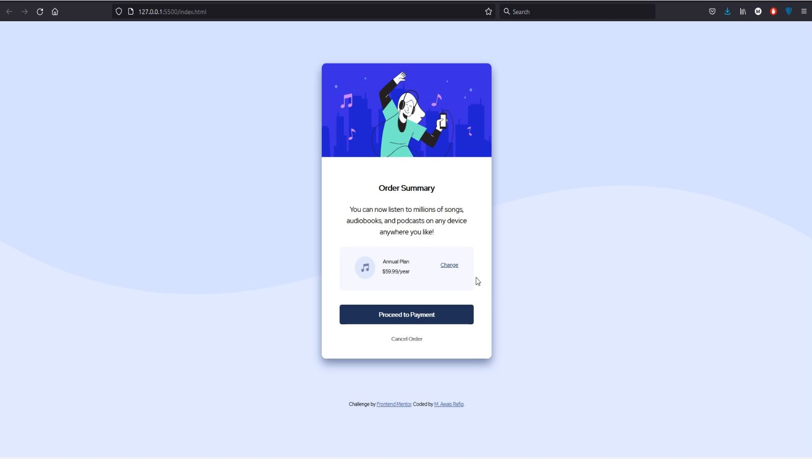

# Frontend Mentor - Order summary card solution

This is a solution to the [Order summary card challenge on Frontend Mentor](https://www.frontendmentor.io/challenges/order-summary-component-QlPmajDUj). Frontend Mentor challenges help you improve your coding skills by building realistic projects. 

## Table of contents

- [Overview](#overview)
  - [The challenge](#the-challenge)
  - [Screenshot](#screenshot)
- [My process](#my-process)
  - [Built with](#built-with)
  - [What I learned](#what-i-learned)
  - [Continued development](#continued-development)
  - [Useful resources](#useful-resources)
- [Author](#author)
- [Acknowledgments](#acknowledgments)

**Note: Delete this note and update the table of contents based on what sections you keep.**

## Overview

### The challenge

Users should be able to:

- See hover states for interactive elements

### Screenshot

## My process

### Built with

- HTML
- CSS Styles
- Flex
- Media Query

**Note: These are just examples. Delete this note and replace the list above with your own choices**

### What I learned
First project/challenge ever attempted. I learned how to write simple HTML markup. Usage of classes and ids for css syles. First time styling a webpage using CSS. Usage of flex, padding, margins and media query.

### Continued development

Look forward to more challenge to achieve better organised form of workflow as well as both HTML and CSS structures.

### Useful resources

- VSCode
- Firefox

## Author

- Frontend Mentor - [@MAwaisRafiq](https://www.frontendmentor.io/profile/MAwaisRafiq)
- Twitter - [@yourusername](https://www.twitter.com/mawir93)

## Acknowledgments

Freecodecamp.org

Kevin powell: Youtube
https://www.youtube.com/kepowob

